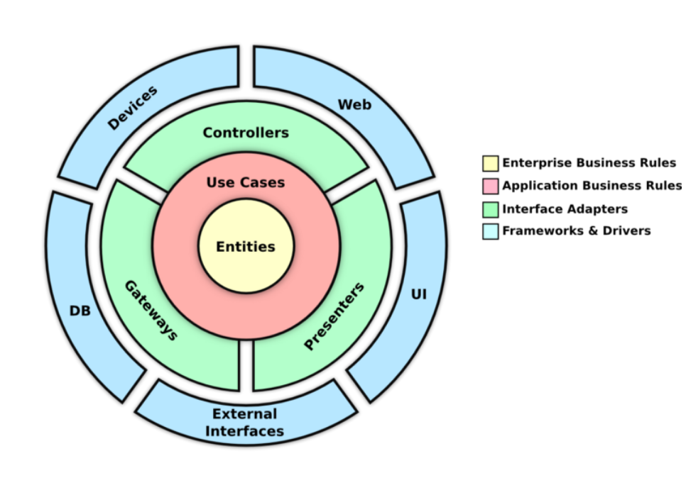

# Credit Engine API

Loan simulation API developed with Spring Boot and Kotlin.

## 🚀 How to run

### Prerequisites
- Java 17+ (for local execution)
- Docker (for container execution)

### Running locally

```bash
./gradlew bootRun
```

### Running with Docker

#### Option 1: Docker Build + Run
```bash
# Build image
docker build -t credit-engine .

# Run container
docker run -p 8080:8080 credit-engine
```

#### Option 2: Docker Compose
```bash
docker-compose up --build
```

The application will be available at: `http://localhost:8080`

## 📚 API Documentation

After starting the application, access:

- **Swagger UI**: http://localhost:8080/swagger
- **OpenAPI JSON**: http://localhost:8080/v3/api-docs

## 🔧 Endpoints

### POST /simulations

Performs loan simulation based on amount, birthdate, and number of installments.

**Request example:**
```json
{
  "amount": 10000.00,
  "birthdate": "15/03/1990",
  "installments": 12
}
```

**Response example:**
```json
{
  "totalAmount": 10400.00,
  "installmentAmount": 866.67,
  "totalFee": 400.00
}
```

**Validations:**
- `amount`: Must be positive
- `birthdate`: Format dd/MM/yyyy
- `installments`: Must be positive integer

**Fee Calculation:**
- Age 18-25: 5% annual rate
- Age 26-40: 3% annual rate  
- Age 41-60: 2% annual rate
- Age 60+: 4% annual rate

## 🧪 Tests

### Run all tests
```bash
./gradlew test
```

### Run specific test classes
```bash
./gradlew test --tests "*SimulationServiceTest"
./gradlew test --tests "*SimulationsControllerTest"
```

### Test Coverage
- Unit tests for business logic (`SimulationService`, `FeeService`)
- Integration tests for API endpoints (`SimulationsController`)
- Validation tests for request/response handling

## 🔍 Code Quality

### Linting with Detekt
```bash
./gradlew detekt
```

### Auto-fix formatting issues
```bash
./gradlew detektFormat
```

## 🐳 Docker

### Useful commands

```bash
# Build image
docker build -t credit-engine .

# Run container
docker run -p 8080:8080 credit-engine

# Run in background
docker run -d -p 8080:8080 --name credit-engine-app credit-engine

# View logs
docker logs credit-engine-app

# Stop container
docker stop credit-engine-app
```

## 🛠️ Technologies

- **Kotlin** - Programming language
- **Spring Boot** - Web framework
- **Spring Validation** - Data validation
- **SpringDoc OpenAPI** - API documentation
- **JUnit 5** - Unit testing
- **MockK** - Mocking for tests
- **Detekt** - Code analysis and formatting
- **Docker** - Containerization
- **Gradle** - Build tool

## 📁 Project Structure

The project follows Clean Architecture principles to ensure separation of concerns, scalability, and testability.

- Domain layer: business rules, independent of frameworks.
- Service layer: orchestration and use case logic.
- Controller layer: handles HTTP requests and responses.



## 🚀 Getting Started

1. **Clone the repository**
2. **Run locally**: `./gradlew bootRun`
3. **Access Swagger**: http://localhost:8080/swagger
4. **Run tests**: `./gradlew test`
5. **Check code quality**: `./gradlew detekt`